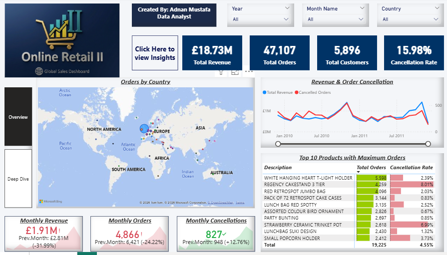
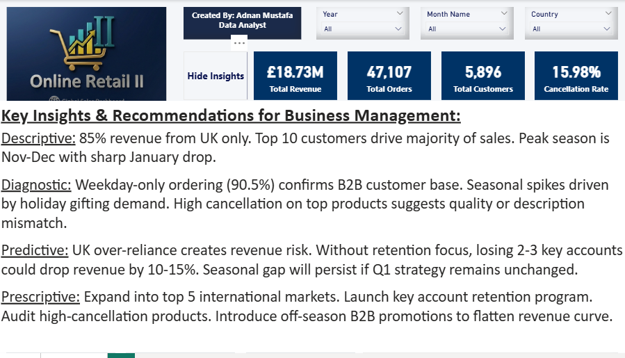
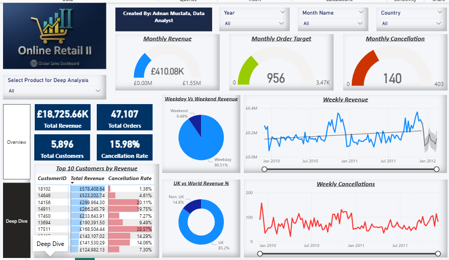

#  Online Retail II  End-to-End Data Analytics Project

##  Dashboard Preview

### Overview Page


### Key Insights & Recommendations Panel


### Deep Dive Page


> **From raw data to business intelligence, a complete analytics pipeline built on 1M+ real-world transactions.**

---

##  Project Overview

This project demonstrates a full end-to-end data analytics workflow using the **UCI Online Retail II dataset** from Kaggle. The dataset contains over **1 million retail transactions** from a UK-based online retailer between 2009 and 2011.

The goal was not just to build a dashboard, but to simulate the exact workflow a **Data Analyst follows in a real industry environment**: raw data ingestion, rigorous cleaning, cloud database design, dimensional modeling, and business intelligence reporting.

---

##  Business Questions Answered

- What is the total revenue, and how does it trend over time?
- Which customers and products drive the most revenue?
- What is the cancellation rate, and which products are most affected?
- How does UK revenue compare to international markets?
- Are customers primarily B2B or B2C?
- Is the business meeting its monthly revenue and order targets?

---

##  Tools & Technologies

| Layer | Tool |
|-------|------|
| Data Cleaning & Validation | Python (Pandas) |
| Cloud Database | MySQL on Aiven, Table Design & Data Loading |
| Data Modeling | Star Schema (Power BI Data Model) |
| Business Intelligence | Microsoft Power BI |
| Version Control | GitHub |

---

##  Project Architecture

```
Kaggle Dataset (CSV)
        ↓
Python (Pandas) — Data Cleaning & Validation
        ↓
MySQL on Aiven Console — Star Schema Design
        ↓
Power BI — Data Modeling & Dashboard
        ↓
Business Insights & Recommendations
```

---

##  Phase 1: Data Cleaning (Python)

**Dataset:** Online Retail II  1,067,371 rows × 8 columns

### Issues Identified & Resolved

| Issue | Rows Affected | Action Taken |
|-------|--------------|--------------|
| Duplicate rows | 34,335 | Dropped |
| Negative price (bad debt entries) | 5 | Dropped |
| Zero price rows | 6,014 | Dropped |
| Non-product StockCodes (POST, DOT, etc.) | 5,168 | Dropped |
| Missing Customer IDs | 243,007 | Assigned ID = 0 (Guest) |
| Null Descriptions | 4,382 | Forward-filled using StockCode grouping |
| Cancelled Invoices | 19,494 | Flagged in Order_Status column |

**Final clean dataset: 1,021,849 rows**

### Key Cleaning Decisions

- **Missing Customer IDs** were not dropped, they were assigned `0` to preserve transaction data. Guest customers are filtered out in customer-level analysis.
- **Negative quantities** were investigated and confirmed to be exclusively linked to cancelled invoices (Invoice starting with 'C'), not standalone returns.
- **Order_Status** column was engineered: `Delivered` for positive quantity invoices, `Cancelled` for invoices starting with 'C'.
- **Revenue** column was engineered: `Quantity × Price`

---

##  Phase 2: Cloud Database & Star Schema (MySQL on Aiven)

### Why Aiven Comsole MySQL?
Aiven provides a managed cloud MySQL instance, simulating the real world scenario where data resides in a cloud database rather than local files.

### Star Schema Design

```
                    ┌─────────────────┐
                    │  Calendar_Lookup │
                    │  (Date, Month,   │
                    │   Year, Weekday) │
                    └────────┬────────┘
                             │ 1
                             │
┌──────────────┐    *        │        1    ┌──────────────────┐
│Products_Lookup├────────────┤─────────────┤ Customers_Lookup │
│ (ProductID,  │            │             │  (CustomerID)    │
│ Description) │      ┌─────┴──────┐      └──────────────────┘
└──────────────┘      │ Sales_Data │
                      │  (FACT)    │
                      │            │
                      │ Invoice    │
                      │ ProductID  │
                      │ CustomerID │
                      │ InvoiceDate│
                      │ Quantity   │
                      │ Price      │
                      │ Revenue    │
                      │ Country    │
                      │ OrderStatus│
                      └────────────┘
> **Note:** Calendar_Lookup was built directly in Power BI using DAX 
> (ADDCOLUMNS + CALENDAR function) rather than MySQL, 
> as date intelligence tables are commonly managed at the BI layer.

```

### Tables Created

| Table | Rows | Purpose |
|-------|------|---------|
| online_retail_II | 1,021,849 | Raw cleaned data |
| Sales_Data | 1,021,849 | Fact table |
| Products_Lookup | 4,756 | Product dimension |
| Customers_Lookup | 5,896 | Customer dimension |

**Data was loaded in 20,000 row chunks** using Python SQLAlchemy to avoid timeout issues on the cloud connection.

---

##  Phase 3: Power BI Dashboard

### Data Model
- Calendar_Lookup → Sales_Data (on Date → InvoiceDate) — One to Many
- Products_Lookup → Sales_Data (on ProductID) — One to Many
- Customers_Lookup → Sales_Data (on CustomerID) — One to Many

### DAX Measures Created

```dax
Total Revenue = SUM(Sales_Data[Revenue])
Total Orders = DISTINCTCOUNT(Sales_Data[Invoice])
Total Customers = DISTINCTCOUNT(Sales_Data[CustomerID])
Total Qty Sold = SUM(Sales_Data[Quantity])
Average Order Value = DIVIDE([Total Revenue], [Total Orders])
Cancellation Rate = DIVIDE(CALCULATE([Total Orders], Sales_Data[OrderStatus] = "Cancelled"), [Total Orders])
Delivered Revenue = CALCULATE([Total Revenue], Sales_Data[OrderStatus] = "Delivered")
Prev.Month Revenue = CALCULATE([Total Revenue], PREVIOUSMONTH(Calendar_Lookup[Date]))
Monthly Revenue Target = CALCULATE([Total Revenue], PREVIOUSMONTH(Calendar_Lookup[Date])) * 1.10
Weekend Orders = CALCULATE([Total Orders], Calendar_Lookup[Weekend] = "Weekend")
```

### Dashboard Pages

**Page 1  Overview**
- KPI Cards: Total Revenue, Orders, Customers, Cancellation Rate
- Orders by Country (Map)
- Revenue & Order Cancellation trend (Line Chart)
- Top 10 Products by Total Orders with Cancellation Rate
- Monthly Revenue, Orders & Cancellations with Previous Month comparison
- Toggle Insights Panel (show/hide)

**Page 2  Deep Dive**
- Monthly Revenue, Order Target & Cancellation Gauges
- Top 10 Customers by Revenue (Guest customers excluded)
- Weekday vs Weekend Revenue (Donut Chart)
- UK vs World Revenue % (Donut Chart)
- Weekly Revenue & Cancellations trend
- Product-level slicer for drill-down analysis


- **Interactive Insights Panel**  A toggle button on the Overview page 
  allows users to show or hide a business insights panel on demand. 
  Clicking "Click Here to view Insights" reveals a full analysis covering 
  Descriptive, Diagnostic, Predictive, and Prescriptive insights. 
  Clicking "Hide Insights" collapses the panel, keeping the dashboard 
  clean for day-to-day use. This feature was built using Power BI 
  Bookmarks and Selection pane, a technique commonly used in 
  professional BI reporting.
---

##  Key Insights & Recommendations

###  Descriptive — What Happened?
85% of revenue came from the UK. Top 10 customers drove a disproportionate share of sales. Revenue peaked every November–December with a sharp January drop. 90.51% of orders were placed on weekdays.

###  Diagnostic — Why Did It Happen?
Weekday-only ordering confirms a B2B customer base — businesses order during working hours. Seasonal spikes are driven by holiday gifting demand. High cancellation on top products suggests product description mismatch or stock issues.

###  Predictive — What Will Happen?
UK over-reliance creates concentration risk. Without retention focus, losing 2–3 key accounts could drop revenue by 10–15%. Seasonal cash flow gaps will persist if Q1 strategy remains unchanged.

###  Prescriptive — What Should Be Done?
Expand into top 5 international markets. Launch a key account retention program. Audit high-cancellation products. Introduce off-season B2B promotions to flatten the revenue curve.

---

## 📁 Repository Structure

```
Online-Retail-II/
│
├── 📂 python/
│   └── online_retail_II.ipynb       # Data cleaning notebook
│
├── 📂 sql/
│   └── star_schema.sql              # Table creation queries
│
├── 📂 assets/
│   ├── dashboard_overview.png       # Overview page screenshot
│   └── dashboard_deepdive.png       # Deep Dive page screenshot
│
├── 📂 powerbi/
│   └── Online_Retail_II.pbix        # Power BI file
│
└── README.md
```

---

##  How to Reproduce

1. Download the dataset from [Kaggle — Online Retail II](https://www.kaggle.com/datasets/mashlyn/online-retail-ii-uci)
2. Run `python/online_retail_II.ipynb` for data cleaning
3. Set up a MySQL database and run `sql/star_schema.sql`
4. Open `powerbi/Online_Retail_II.pbix` and update the MySQL connection string
5. Refresh the data and explore the dashboard

---

##  Author

**Adnan Mustafa**
Data Analyst


---

## 📄 Dataset Source

- **Name:** Online Retail II UCI
- **Source:** [Kaggle](https://www.kaggle.com/datasets/mashlyn/online-retail-ii-uci)
- **Original Source:** UCI Machine Learning Repository
- **License:** Public Domain
